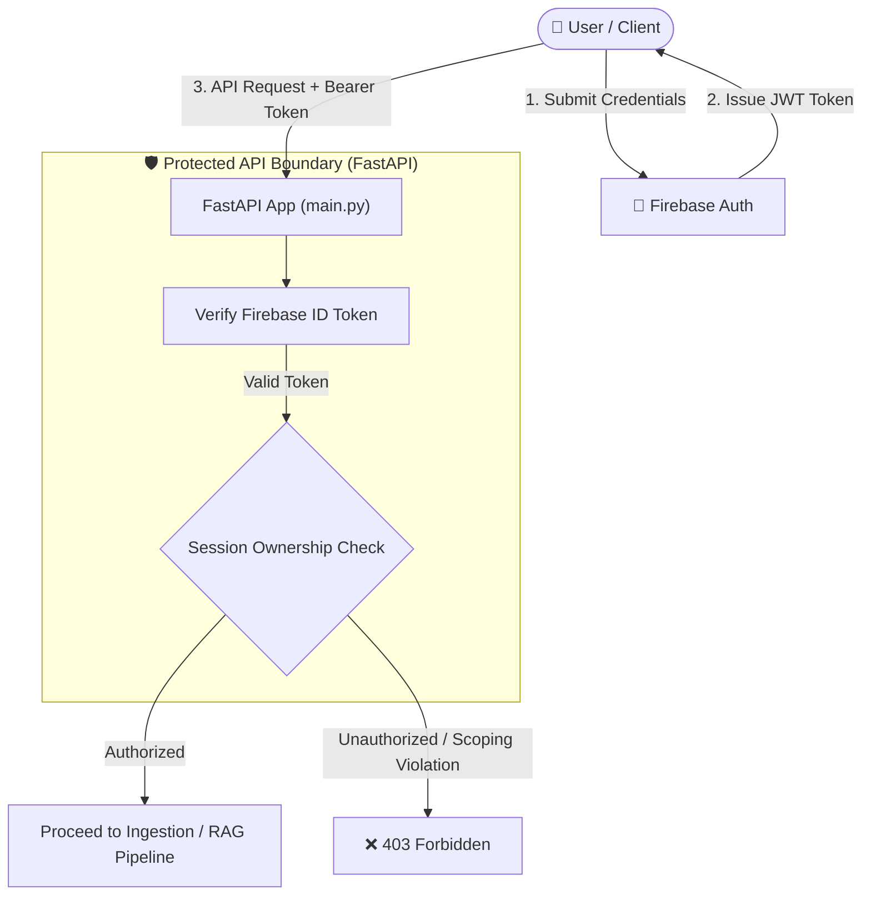
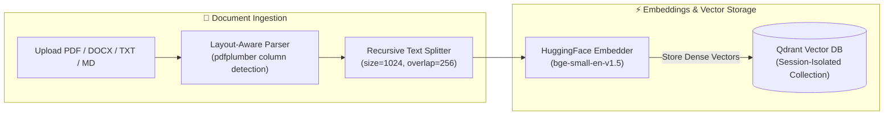
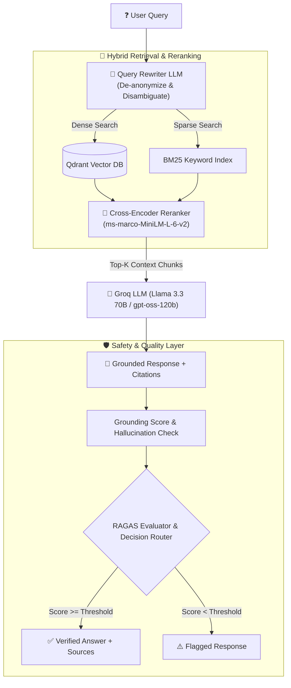

# 🔐 Access-Controlled Document Retrieval Application

[](https://fastapi.tiangolo.com/)
[](https://www.python.org/)
[](https://firebase.google.com/)
[](https://qdrant.tech/)
[](https://www.langchain.com/)
[](https://groq.com/)
[](https://opensource.org/licenses/MIT)

> An enterprise-grade, privacy-first **Retrieval-Augmented Generation (RAG) System** built with **FastAPI**, **Firebase Auth**, **Qdrant Cloud**, **HuggingFace Embeddings**, and **Groq LLM**. Features hybrid vector-sparse retrieval, multi-tenant document session isolation, cross-encoder reranking, hallucination guardrails, and automated RAGAS quality evaluation.

---

## 📑 Table of Contents

- [✨ Key Features](#-key-features)
- [🏗️ System Architecture & Data Flow](#️-system-architecture--data-flow)
  - [1. Security & Authentication Boundary](#1-security--authentication-boundary)
  - [2. Multi-Column Ingestion & Vector Pipeline](#2-multi-column-ingestion--vector-pipeline)
  - [3. Hybrid Retrieval & Grounded Generation Pipeline](#3-hybrid-retrieval--grounded-generation-pipeline)
- [💻 Tech Stack](#-tech-stack)
- [📂 Monorepo & Directory Structure](#-monorepo--directory-structure)
- [🔌 API Specifications & Endpoint Guide](#-api-specifications--endpoint-guide)
- [🚀 Quickstart & Installation Guide](#-quickstart--installation-guide)
- [🛡️ Security & Privacy Guarantees](#️-security--privacy-guarantees)
- [📜 License](#-license)

---

## ✨ Key Features

- 🔒 **Zero-Trust Access Control & Session Isolation**
  - Authenticated via **Firebase ID Tokens** on every endpoint.
  - Documents, chat history, and Qdrant vector collections are strictly scoped per user session (returns `403 Forbidden` on unauthorized access attempts).
- 📄 **Layout-Aware Multi-Format Document Ingestion**
  - Native support for **PDF**, **DOCX**, **TXT**, and **Markdown** (`.md`).
  - Column-aware PDF parser (`pdfplumber`) detects multi-column layouts (resumes, academic papers) and extracts text top-to-bottom per column without merging unrelated paragraphs.
- ⚡ **Hybrid Search & Cross-Encoder Reranking**
  - **Dense Retrieval**: `BAAI/bge-small-en-v1.5` embeddings stored in session-isolated Qdrant collections.
  - **Sparse Retrieval**: BM25 keyword search over document chunks.
  - Reciprocal Rank Fusion (RRF) and cross-encoder reranking (`cross-encoder/ms-marco-MiniLM-L-6-v2`) prioritize high-precision context chunks.
- 🔮 **Conversational Query Rewriter**
  - Detects ambiguous or follow-up user queries and leverages LLM rewriting before retrieval to preserve historical intent.
- 🛡️ **Hallucination Detection & Grounding Scores**
  - Every answer is validated through a hallucination filter that computes a quantitative grounding score and returns inline source citations.
- 📊 **On-Demand RAGAS Quality Assessment**
  - Evaluates **Faithfulness**, **Answer Relevancy**, and **Hallucination Rate** per response.
  - Features intelligent evaluation caching to minimize LLM overhead.
  - Integrated decision router (`ACCEPT`, `RETRY`, `FALLBACK`, `REJECT`).
- 🎨 **Modern Embedded Web Dashboard**
  - Out-of-the-box browser interface (`index.html`) supporting user registration, authentication, document attachments, real-time chat, source citation view, and evaluation telemetry.

---

## 🏗️ System Architecture & Data Flow

### 1. Security & Authentication Boundary



---

### 2. Multi-Column Ingestion & Vector Pipeline



---

### 3. Hybrid Retrieval & Grounded Generation Pipeline



---

## 💻 Tech Stack

| Layer | Technology | Description |
|---|---|---|
| **API Framework** | **FastAPI** | High-performance Python async backend API |
| **Authentication** | **Firebase Auth** | Role-Based Access Control & JWT identity verification |
| **LLM Engine** | **Groq API** | Ultra-fast inference (`llama-3.3-70b-versatile` / `openai/gpt-oss-120b`) |
| **Embeddings** | **HuggingFace** | `BAAI/bge-small-en-v1.5` for dense vector representations |
| **Vector DB** | **Qdrant Cloud** | Session-isolated multi-tenant vector collection storage |
| **Sparse Retrieval** | **BM25** | Keyword-frequency retrieval fusion |
| **Reranker** | **SentenceTransformers** | `cross-encoder/ms-marco-MiniLM-L-6-v2` |
| **Evaluation** | **RAGAS** | Automated metric verification (Faithfulness, Relevancy) |
| **Frontend UI** | **HTML5 / CSS3 / JS** | Embedded single-page dashboard (`index.html`) |

---

## 📂 Monorepo & Directory Structure

```text
Access-Controlled-Document-Retrieval-Application/
├── auth.py              # Firebase authentication middleware & token verification
├── main.py              # Main FastAPI application routes & dependency injection
├── index.html           # Full-featured web UI dashboard
├── requirements.txt     # Python dependencies manifest
├── configs/             # System parameters & vector search configurations
├── embeddings/          # Embedding model loaders & vectorizers
├── ingestion/           # Layout-aware document parsing & chunking logic
├── vectorstore/         # Qdrant client wrappers & collection managers
├── retrieval/           # Hybrid search (Dense + BM25) & cross-encoder reranker
├── rag/                 # RAG chain orchestration, query rewriter, & LLM prompts
├── guardrails/          # Hallucination filter & grounding score calculation
├── evaluation/          # RAGAS metrics evaluator & decision routing layer
├── observability/       # Structured JSON logging & telemetry
└── tests/               # Pytest suite for API, Auth, and Retrieval pipeline
```

---

## 🔌 API Specifications & Endpoint Guide

| Method | Endpoint | Description | Auth Required |
|---|---|---|:---:|
| `POST` | `/auth/login` | Authenticate user via Firebase & obtain session token | ❌ |
| `POST` | `/upload` | Ingest documents (PDF, DOCX, TXT, MD) into session collection | ✅ |
| `POST` | `/chat` | Submit grounded query & retrieve answer with source citations | ✅ |
| `POST` | `/evaluate` | Run RAGAS metrics check on a generated answer | ✅ |
| `GET` | `/sessions` | List active document sessions owned by authenticated user | ✅ |
| `DELETE`| `/sessions/{id}`| Purge session documents & Qdrant collection | ✅ |
| `GET` | `/health` | Service health status & database connectivity check | ❌ |

---

## 🚀 Quickstart & Installation Guide

### Prerequisites
- **Python**: Version `3.10+`
- **Qdrant Vector Database**: Cloud instance cluster URL & API Key
- **Groq API Key**: For LLM generation
- **Firebase Project**: Service account credentials JSON / Web API credentials

### 1. Clone Repository & Setup Virtual Environment
```bash
git clone git@github.com:shaikazeem2001/Access-Controlled-Document-Retrieval-Application.git
cd Access-Controlled-Document-Retrieval-Application

python3 -m venv venv
source venv/bin/activate
```

### 2. Install Dependencies
```bash
pip install -r requirements.txt
```

### 3. Configure Environment Variables
Create a `.env` file in the root directory:
```env
# Server Config
PORT=8000
ENV=development

# Firebase Config
FIREBASE_CREDENTIALS_PATH=./firebase-credentials.json

# Qdrant Cloud Vector Store
QDRANT_URL=https://your-qdrant-cluster-url.qdrant.tech
QDRANT_API_KEY=your_qdrant_api_key

# LLM & Embeddings
GROQ_API_KEY=your_groq_api_key
HUGGINGFACE_HUB_TOKEN=your_huggingface_token
```

### 4. Launch Application
```bash
uvicorn main:app --host 0.0.0.0 --port 8000 --reload
```

Open your browser and navigate to `http://localhost:8000` to interact with the web UI, or check Swagger docs at `http://localhost:8000/docs`.

---

## 🛡️ Security & Privacy Guarantees

1. **Strict User Scoping**: No user can access or query another user's uploaded documents or vector index.
2. **Ephemeral Session Collections**: Qdrant collections are programmatically linked to user IDs and session keys.
3. **Fail-Safe Decision Routing**: Decision layer or evaluation errors fail open gracefully—never blocking response delivery while logging security alerts.

---

## 📜 License

Distributed under the [MIT License](./LICENSE). Copyright © 2026 [Azeem Shaik](https://github.com/shaikazeem2001).